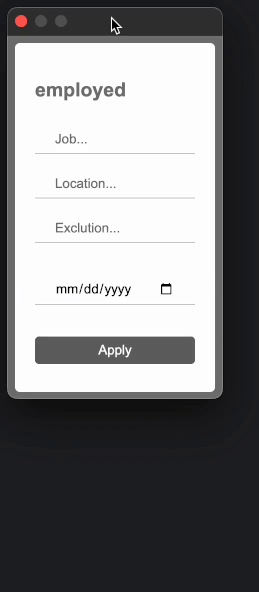

# employed

- Chrome extension used to search for jobs of all types effortlessly

- Download the "employed" folder and go to your browsers extension upload page. Specific browsers listed below

  [chrome://extensions/](chrome://extensions/)\
  [brave://extensions/](brave://extensions/)\
  [arc://extensions/](arc://extensions/)

- Click on the "Developer mode" radio button on the top right
- Finally, click on the "Load unpacked" and select the employed folder. Enjoy!
